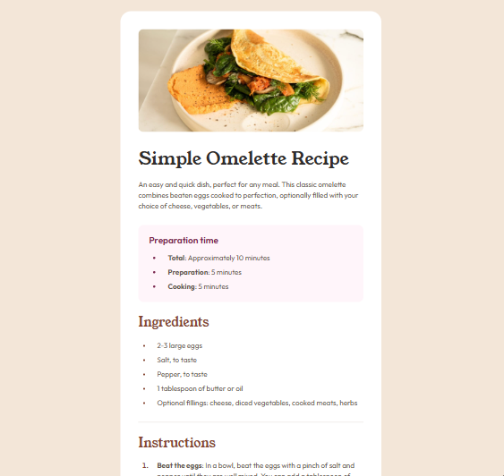

# Frontend Mentor - Recipe page solution

This is a solution to the [Recipe page challenge on Frontend Mentor](https://www.frontendmentor.io/challenges/recipe-page-KiTsR8QQKm). Frontend Mentor challenges help you improve your coding skills by building realistic projects.

## Table of contents

- [Overview](#overview)
  - [The challenge](#the-challenge)
  - [Screenshot](#screenshot)
  - [Links](#links)
- [My process](#my-process)
  - [Built with](#built-with)
  - [What I learned](#what-i-learned)
  - [Continued development](#continued-development)
  - [Useful resources](#useful-resources)
- [Author](#author)
- [Acknowledgments](#acknowledgments)

## Overview

### The challenge

The challenge was to build a static recipe page following the provided design and to make it as close as possible to the original, focusing on:

- Semantic HTML5 markup
- CSS for styling and layout
- Responsiveness for different screen sizes

### Screenshot

### Links

- Solution URL: [Add solution link here](#)
- Live Site URL: [Add live site URL here](#)

## My process

### Built with

- Semantic HTML5 markup
- CSS for styling and layout
- [BEM](https://getbem.com/) methodology for class naming
- CSS modularization for maintainability
- Normalize.css for consistent cross-browser styling

### What I learned

This project helped me improve my understanding of:

- The BEM methodology and its advantages in scalable CSS architecture
- Modular CSS structure for better maintainability
- Using semantic HTML for improved accessibility
- Handling image `alt` text for screen readers

### Continued development

Moving forward, I want to:

- Enhance the responsiveness by implementing more advanced media queries.
- Add ARIA attributes to further improve accessibility.
- Experiment with CSS Grid for more complex layouts.

### Useful resources

- [BEM Documentation](https://getbem.com/) - Helped me understand and implement BEM methodology.
- [MDN Web Docs](https://developer.mozilla.org/) - My go-to resource for HTML and CSS references.
- [Normalize.css](https://necolas.github.io/normalize.css/) - Ensures a consistent baseline for styling across browsers.

## Author

- Frontend Mentor - [@bastianrecr](https://www.frontendmentor.io/profile/bastianrecr)
- LinkedIn - [Sebastian Regules](www.linkedin.com/in/sebastian-regules-763b5624b)

## Acknowledgments

Special thanks to Frontend Mentor for providing realistic projects that challenge and grow coding skills. This project was a valuable learning experience!
